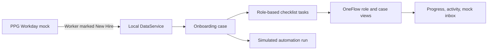
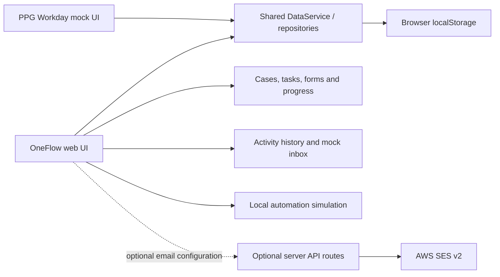
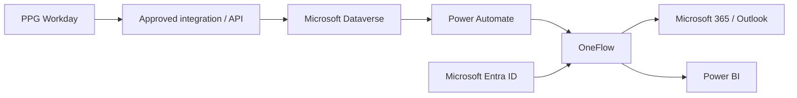

# OneFlow Project Documentation

> The complete, presentation-ready Word package is [OneFlow_Project_Documentation.docx](OneFlow_Project_Documentation.docx). This Markdown file remains the repository-friendly source summary.

> **Project Status:** Hackathon Prototype / Phase 1
>
> **Last Updated:** 19 August 2026

OneFlow was created by Team Error 404 for **PPG AEN Hackathon 2026**. This document describes the repository as it exists today. References to Microsoft Power Platform and enterprise integration describe a proposed production direction, not deployed functionality. The Word package includes validated deployment documentation, implementation-versus-future boundaries, diagram assets, user guidance, and indicative public-list-price planning assumptions checked on 19 August 2026.

## 1. Project Overview

**OneFlow** is a browser-based employee-lifecycle prototype that coordinates onboarding and offboarding activities across the people involved. It is designed to give HR, IT, Facilities, hiring managers, administrators, and employees a shared view of work, ownership, progress, forms, and workflow activity.

The project addresses the common onboarding challenge where employee information and follow-up actions are distributed across teams and tools. The Phase 1 prototype demonstrates how a new-hire event in a mock **PPG Workday** source application can create a coordinated OneFlow case, generate role-based work, track completion, and record simulated notifications. It also contains a prototype offboarding journey.

Key benefits demonstrated are clearer accountability, a visible checklist and progress measure, a consolidated activity trail, role-filtered work views, and a foundation for replacing local demo storage with enterprise services later.

## 2. Business Problem

Employee onboarding requires several teams to act on the same employee record. Without a shared orchestration layer, information can be fragmented, hand-offs can be manual, task ownership can be unclear, and managers may have limited visibility into whether a new starter is ready.

OneFlow is intended to reduce this coordination gap by turning lifecycle events into an assigned checklist, tracking the status of each action, surfacing reminders and activity, and providing views tailored to the people completing the work. The same coordination pattern is also demonstrated for employee departures.

## 3. Solution Overview

In the current prototype, **PPG Workday** is a demo/mock HR source application, not the real Workday product. It manages sample worker records and their employment status. **OneFlow** is the central lifecycle-management application using the same local data service.

### Current onboarding flow



When a worker is created or updated to **New Hire**, the prototype creates one onboarding case for that worker and generates the configured checklist (the seeded default has 14 tasks). The UI tracks task state, dependencies where configured, progress, activity history, and mock workflow notifications. Automation is simulation-first: it records payloads and outcomes locally; it does not call Power Automate.

Offboarding follows a related prototype flow when a worker is marked **Offboarding**: an offboarding case and tasks are generated from local templates, and the application tracks clearance, asset/access work, progress, risk, mock emails, and simulated runs.

## 4. Current Features

The following functionality is present in this repository.

| Area | Verified prototype capability |
| --- | --- |
| PPG Workday | Mock worker directory; search/filter; create, view, and edit worker records; employment-status changes that initiate lifecycle workflows. |
| Onboarding | Case creation, local checklist templates, role/team assignment, task updates, dependencies, due/reminder fields, progress, history, and new-hire/case views. |
| Offboarding | Departure cases, templates and tasks, risk/progress views, upcoming departures, assets/access-removal queues, exit-clearance forms, and simulated notifications. |
| Forms and journeys | Prototype employee onboarding and offboarding views; induction, access-card, exit-clearance, and laptop-request workflow components. |
| Work management | Admin dashboard, role-filtered **My Tasks**, Hiring Manager new-hire view, employee profile and self-service journey pages. |
| Notifications | Local mock inbox with read/unread state, filtering, attachments represented as mock documents, and automation-run history. |
| Optional email | Server-side AWS SES v2 support for configured email modes (`mock`, `ses`, or `both`); mock inbox remains the built-in audit channel. |
| Data layer | `DataService`/repository abstraction with a localStorage implementation and a Dataverse placeholder. |
| Authentication | Prototype local demo-account/session handling and role-aware UI/access checks. It is not enterprise SSO. |
| Reporting | In-app operational snapshot page; no Power BI integration. |

## 5. How to Use OneFlow

### Prerequisites

- Node.js is required for local development. The repository does not declare a local Node.js version; its Docker image uses Node.js 22.
- npm is required because the repository includes `package-lock.json`.
- Docker is optional for local development and required only for the container deployment path.
- No environment variables are required for the normal mock-email demo. Copy `.env.example` to `.env.local` only when configuring optional AWS SES delivery; never put real secrets in source control.

### Installation

```bash
npm install
```

### Running Locally

```bash
npm run dev
```

Open [http://localhost:3000](http://localhost:3000) in a modern browser.

### Application URLs

| Route | Purpose |
| --- | --- |
| `/` | Prototype landing page |
| `/workday` | PPG Workday mock worker directory |
| `/oneflow` | OneFlow overview (role-dependent landing) |
| `/login` | Prototype sign-in page |
| `/oneflow/new-hires` | Admin new-hire list |
| `/oneflow/my-tasks` | Role-filtered assigned tasks |
| `/oneflow/inbox` | Mock workflow inbox |
| `/oneflow/automation-runs` | Simulated automation history |
| `/oneflow/offboarding` | Offboarding dashboard |
| `/oneflow/reports` | In-app operational snapshot |

Additional case, form, profile, settings, and lifecycle routes are linked from the OneFlow navigation according to the prototype role.

### Demo Workflow: Onboarding

1. Open **PPG Workday** at `/workday`.
2. Create a worker or open an existing worker record.
3. Enter the required worker information and set the employment status to **New Hire**.
4. Save the record. The prototype creates an onboarding case once for that worker and generates the local checklist.
5. Open **OneFlow** at `/oneflow`; sign in using a supplied demo account if prompted.
6. Open **New Hires** or the relevant case to locate the employee.
7. Review the assigned checklist and responsible teams.
8. Update an assigned task from **My Tasks** or the case/task view, subject to the prototype’s role and dependency rules.
9. Observe the case progress and activity history update.
10. Open **Mock Inbox** to review workflow notifications and **Mock Automation History** to review simulated runs.
11. From a case or admin controls, run the available mock automation/reminder actions to demonstrate simulation. Live Power Automate is not connected.

## 6. Who Should Use It

| Role | Current prototype purpose |
| --- | --- |
| Administrator | View dashboards, templates, settings, automation history, email-delivery status, and demo controls. |
| HR | Initiate and monitor onboarding; work with employee/induction activities. |
| IT Security / Onsite IT | Receive role-filtered task work, including account and equipment-related onboarding activities. |
| Facilities / Administration | Complete facilities, access-card, clearance, or related lifecycle work where assigned. |
| Hiring Manager | View their new hires and complete manager-owned activities. |
| Employee | Prototype onboarding and offboarding self-service journeys and forms for seeded demo personas. |

Enterprise roles, permissions, and identity lifecycle are future design work; the prototype’s accounts and access checks are for demonstration only.

## 7. Platform / Where OneFlow Should Be Used

### Current Hackathon Prototype

OneFlow is a Next.js/React web application. It runs in a modern browser, shares client-side data between the PPG Workday mock and OneFlow, and can be run locally or as a Docker container. The current persistence mechanism is browser localStorage. The repository also contains Docker Compose guidance for Synology Container Manager.

### Recommended Production Platform

OneFlow is **not intended to replace Workday**. Workday should remain the HR source system; OneFlow should operate as the onboarding orchestration and visibility layer.

The proposed direction is a Microsoft enterprise architecture: PPG Workday feeds an approved integration/API layer and Microsoft Dataverse; Power Automate orchestrates workflows and notifications; OneFlow provides the user experience; and Power BI provides analytics. Microsoft 365/Outlook, Microsoft Entra ID, and Azure services may be used where PPG’s enterprise design requires them. None of Dataverse, Power Automate, Power BI, Workday API integration, or Entra ID SSO is implemented in this repository.

## 8. Architecture

### Current Hackathon Architecture



The optional SES route is server-side and requires runtime configuration. It is not needed for mock-only demonstration.

### Future Production Architecture (Proposed)



This is a target architecture only. Implementation depends on PPG integration, security, licensing, and platform decisions.

## 9. Data Storage

The prototype stores its shared application state in browser `localStorage` through `LocalStorageRepository` (storage key `oneflow-phase1-v3`). The stored demo state includes employee and lifecycle records, tasks, forms, mock emails, activity, and automation-run data.

localStorage makes the demo self-contained and allows data to persist across browser refreshes on the same browser profile. It is appropriate for a hackathon prototype only; it is not a production data store. The UI accesses data through a `DataService`/repository abstraction rather than direct localStorage calls. A `DataverseRepository` placeholder exists so a production backend can replace the local implementation without redesigning the UI contract.

## 10. Deployment

### Local development

```bash
npm install
npm run dev
```

### Production build and start

```bash
npm run build
npm run start
```

### Docker / Docker Compose

```bash
docker compose up --build
```

The `Dockerfile` builds a standalone Next.js image and exposes port 3000. `compose.yaml` provides the container configuration and runtime email variables. Do not add real credentials to the image, repository, or documentation.

### Synology

The repository supports a Synology Container Manager deployment using `compose.yaml`. Follow [Synology deployment guidance](SYNOLOGY_DEPLOYMENT.md) for the current deployment procedure. That guide contains environment and reverse-proxy steps; validate them against the target environment and keep real hostnames, IP addresses, recipient mappings, and credentials outside source control.

## 11. Cost

### Hackathon Prototype Cost

| Component | Prototype Cost | Notes |
| --- | ---: | --- |
| OneFlow application | RM0 | Custom-developed prototype. |
| React, Next.js, and open-source libraries | RM0 | Open-source dependencies. |
| Existing Docker/Synology hosting | RM0 incremental | Only where existing infrastructure is reused. |
| Docker | RM0 | Open-source container tooling. |
| Browser | RM0 | Existing user environment. |
| Mock notification service | RM0 | Local simulation and mock inbox. |
| Optional AWS SES | Usage based | Only when actual SES delivery is configured. |

### Potential Production Cost

| Component | Production cost model | Notes |
| --- | --- | --- |
| Microsoft Dataverse | Enterprise licensing / capacity | Depends on PPG agreement. |
| Power Automate | Enterprise licensing | Depends on flows, users, and licensing model. |
| Power BI | Enterprise licensing | Depends on report consumers. |
| Microsoft 365 / Outlook | Existing or enterprise licensing | Depends on PPG agreement. |
| Workday API | Existing enterprise agreement | Integration access required. |
| Azure services | Consumption based | Only if additional Azure components are required. |
| OneFlow maintenance | Internal development/support effort | Depends on production ownership. |

> Exact production costs are TBD and depend on PPG's existing Microsoft, Workday, Azure and enterprise licensing agreements.

## 12. Security and Data Considerations

The current prototype uses demo/test data, browser storage, simulated integrations, and prototype authentication/authorization. It should not be used to hold production employee PII or as a production access-control system.

Production recommendations include Microsoft Entra ID SSO, centrally managed role-based access control, secure API authentication, HTTPS, centralized secrets management, Dataverse security roles, audit logging, environment separation (DEV/TEST/PROD), retention policies, least-privilege access, and appropriate handling of employee PII. AWS keys, email recipients, tokens, and other credentials must never be hardcoded or exposed to the browser.

## 13. Prototype Limitations

- PPG Workday is a mock application, not a Workday integration.
- The shared data store is localStorage, not Dataverse or a production database.
- Power Automate behavior is simulated; live mode intentionally reports that it is not connected.
- The inbox and many notification records are mock/audit data.
- AWS SES is optional and configuration-dependent; it is not a substitute for a full Microsoft 365 integration.
- Power BI, Entra ID/SSO, production Workday APIs, and enterprise RBAC are not implemented.
- Authentication, accounts, workflow data, and seeded personas are demo-only.
- Browser-local data is not shared across users or devices and can be cleared with browser data.

## 14. Future Roadmap

Potential next phases, subject to stakeholder and architecture decisions, are:

### Phase 2 — Data and integration

- Replace localStorage with Dataverse or an approved enterprise data service.
- Integrate approved Workday events/APIs.
- Implement server-side Power Automate workflows.

### Phase 3 — Enterprise integration and security

- Add Entra ID/SSO and production RBAC.
- Integrate Microsoft 365 notifications where approved.
- Add centralized audit logging and secrets management.

### Phase 4 — Analytics

- Add Power BI dashboards.
- Measure onboarding SLAs, overdue work, completion, and lifecycle trends.

### Phase 5 — Employee experience

- Mature the employee portal, documents, induction schedules, and status visibility.

## 15. Hackathon Demo Guide

Suggested 5–10 minute presentation flow:

1. Explain that onboarding work is often split across HR, IT, Facilities, and managers.
2. Introduce OneFlow as an orchestration and visibility layer, not a Workday replacement.
3. Open the PPG Workday mock and create/select a worker.
4. Set the worker to **New Hire** and save to trigger the prototype case.
5. Open OneFlow and find the resulting onboarding case.
6. Show the role-based checklist and ownership across teams.
7. Complete or update a small number of permitted tasks.
8. Show progress and activity history changing.
9. Open the Mock Inbox and automation history to show simulated notifications.
10. Close with the proposed Workday → Dataverse → Power Automate → OneFlow → Power BI direction and the prototype limitations.

## 16. FAQ

### Is OneFlow replacing Workday?

No. Workday remains the HR source system. OneFlow is intended to orchestrate and provide visibility across the onboarding process.

### Is OneFlow production-ready?

No. This repository is a hackathon prototype / Phase 1 implementation.

### Where is the data stored today?

Prototype application data is stored in the browser’s localStorage through the repository/DataService layer.

### What platform should OneFlow use in production?

The proposed direction is an enterprise Microsoft architecture using approved Workday integration, Dataverse, Power Automate, OneFlow, Power BI, Microsoft 365, and Entra ID as appropriate. It is not implemented here.

### How much does OneFlow cost?

The prototype has RM0 incremental cost when it reuses existing development/hosting infrastructure; optional AWS SES is usage based. Production costs are TBD and depend on enterprise licensing and ownership.

### Can OneFlow integrate with existing PPG systems?

The architecture and data abstraction are intended to support approved integrations. This repository currently implements a mock PPG Workday source and local simulation, not production PPG integrations.

### Can OneFlow send real emails?

Yes, optionally, through server-side AWS SES v2 when runtime credentials, sender, recipient mapping, and an email mode are configured. By default, the demonstrated notification channel is the local Mock Inbox.

### Can OneFlow integrate with Workday?

The current PPG Workday experience is a mock. A future approved Workday API/integration layer could feed enterprise data into the proposed architecture.

## 17. Technology Stack

| Layer | Verified technology |
| --- | --- |
| Frontend | Next.js 15, React 19, TypeScript |
| Styling/UI | Tailwind CSS, PostCSS, Autoprefixer, Lucide React icons, `clsx`, `tailwind-merge` |
| Data/state | Client-side DataService/repository pattern with localStorage persistence |
| Backend/API | Next.js route handlers for email settings, test, and workflow delivery |
| Email | AWS SDK SES v2; optional server-side AWS SES delivery |
| Build/tooling | npm, Next.js build, ESLint configuration, TypeScript, `tsx` test runner |
| Containerization | Docker, Docker Compose, Node.js 22 Alpine image |

No separate database, Dataverse connection, Power Automate connector, Power BI integration, or external backend service is implemented in the repository.

## 18. Repository Structure

```text
.
├── src/
│   ├── app/                 Next.js pages and email API routes
│   ├── components/          Workday, OneFlow, and shared UI components
│   ├── data/                Domain models, seeds, workflows, automation, forms
│   │   └── repositories/    DataService repository interfaces and implementations
│   ├── lib/                 Shared UI utilities
│   └── server/email/        Server-only SES configuration and delivery code
├── docs/                    Deployment and project documentation
├── .env.example             Safe environment-variable template
├── Dockerfile               Standalone production image definition
├── compose.yaml             Docker Compose configuration
├── next.config.js           Next.js runtime/build configuration
└── package.json             Scripts and dependencies
```

## 19. Support / Maintenance

Application logic and domain workflows are primarily in `src/data/`; page and UI behavior is in `src/app/` and `src/components/`. Configuration for optional email delivery is documented in `.env.example`, while Docker runtime configuration is in `compose.yaml`. The deployment guide belongs in `docs/`.

Future maintainers should preserve the DataService/repository boundary when replacing localStorage with an API, Dataverse, or another approved data store. Integrations and credentials should be server-side, secured through the approved secret-management approach, and never hardcoded in client code, source files, images, or documentation.
