# OneFlow — Connected Employee Lifecycle

**PPG AEN Hackathon 2026 · Challenge 4 · Team Error 404**

Thamotharan, Renuka Malar · Ramachandran, Yuganeswary · Hairul Afizee · Bashari, Noorliana

Official demonstration: https://oneflow.highrulez.com

> This document presents the OneFlow solution, how it addresses Hackathon Challenge 4, the prototype evidence, user guide, business value, and proposed production direction.

| | |
| --- | --- |
| **Department** | Admin & MYSCC |
| **Challenge** | Hackathon Challenge 4 — Connected Employee Lifecycle |
| **Priority** | High  ·  Cross-functional |
| **Demonstration** | https://oneflow.highrulez.com |
| **Status** | Hackathon prototype using synthetic data |
| **Team** | Team Error 404 |

**Prepared by Team Error 404**  
Thamotharan, Renuka Malar · Ramachandran, Yuganeswary · Hairul Afizee · Bashari, Noorliana

### Contents

- Executive Summary
- Hackathon Challenge 4 — Connected Employee Lifecycle
- Understanding the Business Problem
- OneFlow — The Proposed Solution
- How OneFlow Addresses Each Challenge Objective
- Did OneFlow Solve Hackathon Challenge 4?
- Business Benefits
- Success Criteria and How We Would Measure Them
- What We Built
- Product Walkthrough
- How OneFlow Works
- Onboarding Scenario — Aziz, Nabila
- Offboarding Scenario — Hamdan, Muhamad Asyraf Naqiyuddin
- Role-Based Collaboration
- User Manual
- How to Send a Prototype Test Email
- Current Prototype Architecture
- Proposed Production Architecture
- Recommended Production Technology
- Prototype vs Production
- Production Readiness, Security, Cost and Roadmap
- 5–10 Minute Demo Guide
- FAQ, Conclusion and Appendix
- How OneFlow Could Be Adopted
- Solution Links & Submission Materials

## Executive Summary

> **Start Here**  
> - Live demo: https://oneflow.highrulez.com  
> - Challenge: Hackathon Challenge 4 — Connected Employee Lifecycle  
> - Team: Error 404  
> - Documentation: this dossier  
> - Final presentation: accompanying PowerPoint

Hackathon Challenge 4, issued by Admin & MYSCC, asks teams to create a more connected and efficient employee journey while improving collaboration among HR, IT, payroll, facilities, managers and employees. The current process is fragmented: onboarding, offboarding, workplace administration, access provisioning and resource management rely on disconnected systems and manual communication. The result is delay, poor visibility, compliance risk and an inconsistent employee experience.

Team Error 404 built OneFlow — an employee lifecycle orchestration prototype. Workday remains the HR source system. OneFlow is the coordination and experience layer around that source. In the target operating model, a hire or exit event triggers OneFlow to create a lifecycle case. In the hackathon prototype, the source event and workflow automation are simulated. The case then becomes owned cross-functional work, employee actions, forms, notifications, and a visible readiness or clearance outcome.

The prototype demonstrates the operating model requested by Challenge 4: a connected employee journey, role-based collaboration, lifecycle visibility, onboarding and offboarding orchestration, access and security responsibilities, and an employee-facing experience. It does not yet prove reduced real-world lead times, measured satisfaction improvement, or enterprise-scale compliance outcomes. Those require production integrations and a governed pilot.

> **Did OneFlow solve Challenge 4?**  
> Yes — at prototype level. The prototype validates the proposed solution approach. A production pilot would validate measurable business impact. OneFlow is demonstrated and validated at prototype level; it is not a fully solved production deployment.

| Reader question | OneFlow answer |
| --- | --- |
| What was Challenge 4? | Connected employee lifecycle across onboarding, offboarding, access, workplace administration and resource management. |
| What did we build? | OneFlow: a shared orchestration layer around Workday for employee journeys and cross-functional work. |
| Does it address the challenge? | Yes. Each official objective is mapped to a prototype capability, with honest status labels. |
| What is implemented vs simulated? | Cases, dashboards, tasks, journeys, forms and inbox are implemented. Automation and Workday events are simulated. Email can optionally use AWS SES for prototype tests. |
| What would production use? | Workday APIs, Microsoft Entra ID, Dataverse, Power Apps, Power Automate, Microsoft 365, Power BI, Key Vault and Azure Monitor. |

## Hackathon Challenge 4 — Connected Employee Lifecycle

**Department:** Admin & MYSCC  
**Priority:** High  
**Cross-functional:** Yes  

### Official problem statement

Employee onboarding, offboarding, workplace administration, access provisioning, and resource management require coordination among multiple departments. The current process relies on fragmented systems, manual communications, and disconnected workflows, resulting in delays, visibility gaps, compliance risks, and inconsistent employee experiences.

Participants are challenged to create a more connected and efficient employee journey while improving collaboration among HR, IT, payroll, facilities, managers, and employees.

### Business impact named by the challenge

- Employee experience
- Employee satisfaction
- Compliance and security
- Operational efficiency
- Resource optimization

### Challenge objectives

- Improve end-to-end employee lifecycle management
- Increase visibility across stakeholders
- Reduce administrative workload
- Enhance workplace resource utilization
- Strengthen compliance and access governance

### Success criteria

- Reduced onboarding and offboarding lead times
- Improved employee satisfaction
- Better process transparency and accountability
- Fewer compliance or access-control gaps
- Higher utilization of workplace resources

### Key constraints

The challenge brief names three constraints: Resources, Technology and Security. OneFlow addresses them as an operating-model proposal, not as already-deployed production controls.

### How the challenge is evaluated

Teams are encouraged to focus on the business problem rather than a predetermined solution. Solutions may leverage AI, automation, analytics, workflow optimization, mobile experiences, integration platforms, or entirely new approaches. Evaluation prioritizes business value, innovation, feasibility, scalability, user experience and measurable impact.

## Understanding the Business Problem

### What this means in practice

An employee does not experience HR, IT, facilities, finance and management as separate programmes. They experience one journey: joining, becoming productive, and later leaving with dignity and control. Behind that journey, many teams own different actions, often in different tools, with status trapped in email threads and local trackers.

- Employee onboarding and offboarding cross many teams, not one department.
- Different departments own different actions — access, equipment, workspace, forms, handover and clearance.
- Systems and communication are fragmented, so follow-up becomes manual.
- Employees still experience one journey, even though many teams operate behind it.
- Delays or missed actions affect Day 1 readiness: accounts, equipment, induction and workplace access.
- Offboarding gaps create access and security risk if accounts, assets or entitlements remain open.
- Management lacks consolidated visibility of who is joining, who is leaving, what is blocked, and who owns the next action.

| Fragmentation today | Business consequence | What a connected layer should provide |
| --- | --- | --- |
| Status lives in email and separate tools | Delays and duplicated follow-up | One lifecycle case with owned tasks |
| Ownership is informal | Work is late or overlooked | Role dashboards and task queues |
| Readiness is assumed | Poor Day 1 experience | Visible Day 1 Readiness |
| Exit control is incomplete | Access and asset risk | Visible Exit Clearance |
| No shared picture for leaders | Weak accountability | Admin dashboard and reports |

## OneFlow — The Proposed Solution

OneFlow is not a Workday replacement. It is the connected orchestration and experience layer around Workday. In the target operating model, a hire or exit event triggers OneFlow to create a lifecycle case. In the hackathon prototype, the source event and workflow automation are simulated. The case then assigns responsibilities to the right roles, gives the employee a journey, and shows whether the organisation is ready — or still exposed.

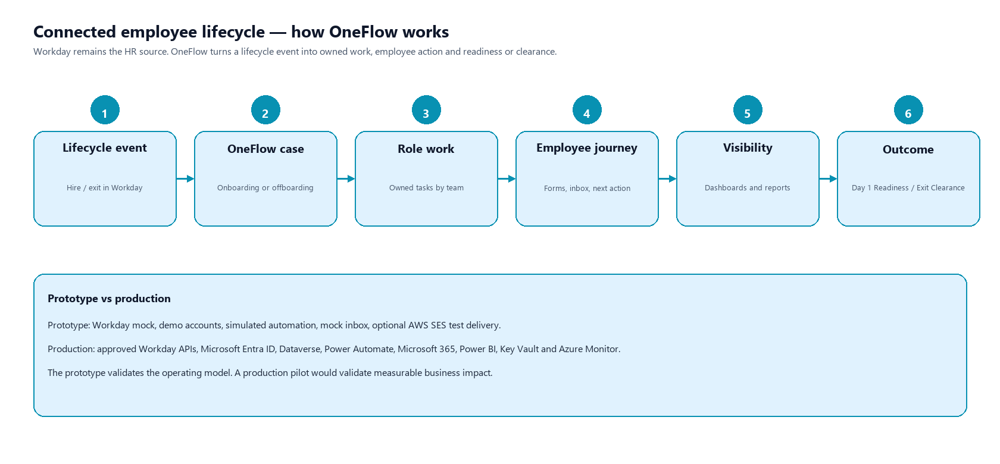

**Figure 1 — Connected employee lifecycle**  
*Challenge 4 asks for a connected employee journey. OneFlow turns a Workday lifecycle event into owned work, employee action, visibility and a readiness or clearance outcome.*

| Layer | Role in the solution | Prototype status |
| --- | --- | --- |
| Workday | Authoritative HR source for worker and lifecycle events | Mock / simulated |
| OneFlow | Case, task, journey, form, inbox and visibility layer | Demonstrated |
| Role teams | HR, IT Security, Onsite IT, Facilities, Finance, manager and specialists complete owned work | Demonstrated |
| Employee | Sees next action, forms, messages and journey progress | Demonstrated |
| Automation and email | Reduce manual chasing conceptually; optional prototype test delivery | Simulated / optional |

## How OneFlow Addresses Each Challenge Objective

The table below uses the official Challenge 4 objectives. Status labels are deliberate: demonstrated means a judge can see the capability in the prototype; partially demonstrated or simulated means the concept is shown but not a measured operational result.

| Challenge objective | How OneFlow addresses it | Prototype evidence | Status |
| --- | --- | --- | --- |
| Improve end-to-end employee lifecycle management | Onboarding and offboarding lifecycle cases, employee journeys, task orchestration, Day 1 Readiness and Exit Clearance. | Nabila onboarding, Hamdan offboarding, Lifecycle Cases. | Demonstrated |
| Increase visibility across stakeholders | Admin dashboard, role dashboards, My Tasks, reports and readiness indicators. | Admin Overview, IT Security dashboard, Reports. | Demonstrated |
| Reduce administrative workload | Automated or simulated task generation, role assignment, notifications, forms and workflow coordination. Fewer manual follow-ups are the intended operating model, not a measured time saving in this prototype. | Automation simulation, forms, inbox, role assignment. | Partially demonstrated / simulated |
| Enhance workplace resource utilization | Equipment, access and facilities-related responsibilities are visible as owned tasks. This is resource-related workflow visibility, not a full inventory or optimization engine. | Laptop, access card, facilities and asset-return tasks. | Partially demonstrated |
| Strengthen compliance and access governance | IT Security tasks, access removal, offboarding security workflow, blocked or outstanding task visibility, and Exit Clearance. Production still requires real identity and security-system integrations. | IT Security dashboard, Hamdan access-removal tasks, Exit Clearance. | Demonstrated at prototype workflow level |

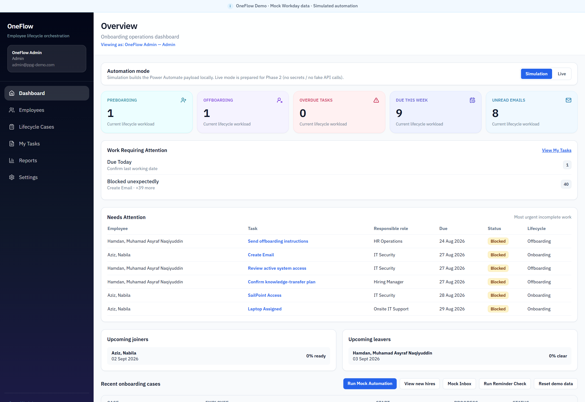

**Figure 2 — Admin dashboard — Preboarding, Offboarding, Needs Attention, joiners and leavers**  
*This screen is evidence for increasing visibility across stakeholders. Leadership can see open onboarding, open offboarding, blocked work, upcoming joiners and upcoming leavers in one place.*

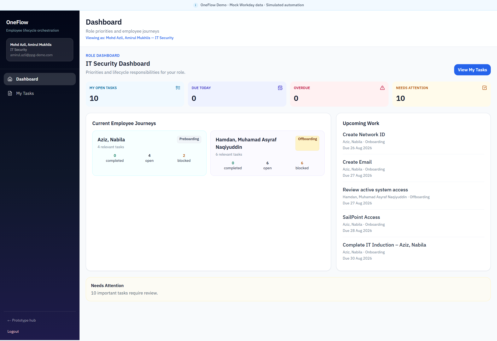

**Figure 3 — IT Security role dashboard**  
*OneFlow gives IT Security a focused view of lifecycle work requiring security action. This demonstrates the Challenge 4 objectives of increasing visibility and strengthening access governance.*

## Did OneFlow Solve Hackathon Challenge 4?

> **Yes — at prototype level.**  
> OneFlow is demonstrated and validated at prototype level. It is not a claim that the challenge is fully solved in production.

OneFlow successfully demonstrates the central concept requested by Challenge 4: a connected employee journey; cross-functional collaboration; clear ownership; visibility; onboarding and offboarding orchestration; access and security responsibilities; and an employee-facing experience.

The prototype does not yet prove:

- Reduced real-world onboarding or offboarding lead times
- Actual employee satisfaction improvement
- Real workplace resource optimization
- Enterprise-scale compliance improvement

Those outcomes require production integrations, identity and security controls, governed data, and measured deployment. Therefore the prototype validates the proposed solution approach. A production pilot would validate measurable business impact.

## Business Benefits

### Business impact alignment

Challenge 4 names five impact areas. OneFlow is designed against those areas, with the same honesty used in the objective mapping.

| Challenge 4 impact area | OneFlow contribution |
| --- | --- |
| Employee experience | One journey for joining or leaving: next action, forms, inbox, countdown to first or last day, and visible progress. |
| Employee satisfaction | Less uncertainty about what to do next. Satisfaction improvement is the intended outcome; it is not measured in the prototype. |
| Compliance and security | IT Security owns access creation and removal inside the same case as HR, facilities and manager work. Outstanding security tasks remain visible until clearance. |
| Operational efficiency | Work is generated, assigned and tracked instead of coordinated only through email. Time saved is conceptual until a pilot measures it. |
| Resource optimization | Equipment, workspace and access tasks are visible so resources can be prepared or recovered. Full utilization analytics remain future scope. |

### Evaluation factors

Challenge evaluation prioritizes business value, innovation, feasibility, scalability, user experience and measurable impact.

| Evaluation factor | OneFlow position |
| --- | --- |
| Business value | Addresses the real lifecycle coordination problem named by Admin & MYSCC, without replacing Workday. |
| Innovation | An employee-centric orchestration layer around the existing HR source, with role and employee experiences in one product. |
| Feasibility | A working prototype already demonstrates UX, workflow, cases, forms, inbox and test-email controls. |
| Scalability | Proposed production architecture uses governed Microsoft enterprise services already familiar to PPG. |
| User experience | Role-specific dashboards and employee-specific journeys, not a single generic queue. |
| Measurable impact | Pilot KPIs are defined: lead time, SLA, overdue rate, incomplete security tasks, and onboarding satisfaction. |

## Success Criteria and How We Would Measure Them

Challenge 4 success criteria are production outcomes. The prototype contributes the operating model and visibility needed to measure them later. This table distinguishes demonstrated concept from measurable production result.

| Success criterion | Prototype contribution | How production would measure it |
| --- | --- | --- |
| Reduced onboarding and offboarding lead times | Central workflow and due-date visibility | Average lifecycle lead time, hire-to-ready and notice-to-cleared |
| Improved employee satisfaction | Employee journey, forms, inbox, next action and readiness | Onboarding / offboarding survey scores |
| Better process transparency and accountability | Role ownership, dashboards, task queues and case progress | Task completion SLA, overdue rate, ownership coverage |
| Fewer compliance or access-control gaps | IT Security offboarding tasks and Exit Clearance | Late account termination and incomplete security tasks |
| Higher utilization of workplace resources | Resource-related tasks made visible | Equipment and workspace allocation / utilization |

## What We Built

The hackathon prototype is a working demonstration, not a slide-only concept. Judges can open the public demo and complete the journeys below using synthetic identities.

- Project hub showing Workday as source and OneFlow as lifecycle platform, plus the proposed Microsoft production path.
- Demo login with employee journeys and role accounts.
- Admin dashboard, role dashboards, Lifecycle Cases, My Tasks, Reports, Settings and Automation simulation.
- Workday mock with a five-worker demo population, including Nabila in Preboarding and Hamdan in Offboarding.
- Nabila onboarding journey: Day 1 Readiness, next action, forms, inbox and profile.
- Hamdan offboarding journey: Exit Clearance, remaining actions and exit stages.
- Email Delivery with server-side credentials, recipient mapping and Send Test Email. AWS SES is prototype-only.

| Capability | Status |
| --- | --- |
| Lifecycle cases, dashboards, My Tasks, journeys, forms, inbox, reports | Implemented in prototype |
| Workday as HR source | Mock / simulated |
| Task generation and notifications | Simulated operating model; inbox implemented |
| Optional real test email | AWS SES configured server-side for prototype tests |
| Entra ID, Dataverse, Power Automate, Power BI, Key Vault, Azure Monitor | Proposed — not implemented |

## Product Walkthrough

The walkthrough uses the live demonstration at https://oneflow.highrulez.com. All people, mailboxes and records are synthetic @ppg-demo.com identities.

### Prototype hub — Workday and OneFlow

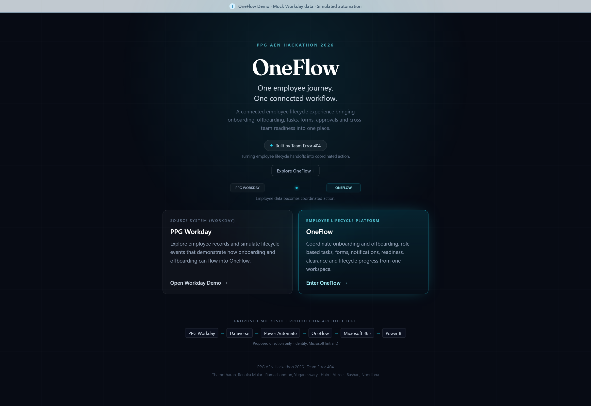

**Figure 4 — OneFlow project hub**  
*The hub states the solution clearly: Workday remains the source system; OneFlow is the employee lifecycle platform; production is proposed on Microsoft services. This is the Challenge 4 idea in one screen.*

### Central lifecycle visibility

The Admin Overview is the management picture Challenge 4 is missing today: Preboarding volume, Offboarding volume, overdue and due work, Needs Attention, upcoming joiners and upcoming leavers. Nabila and Hamdan appear as the current joiners and leavers, with readiness and clearance still at the start of their journeys.

### Workday remains the source

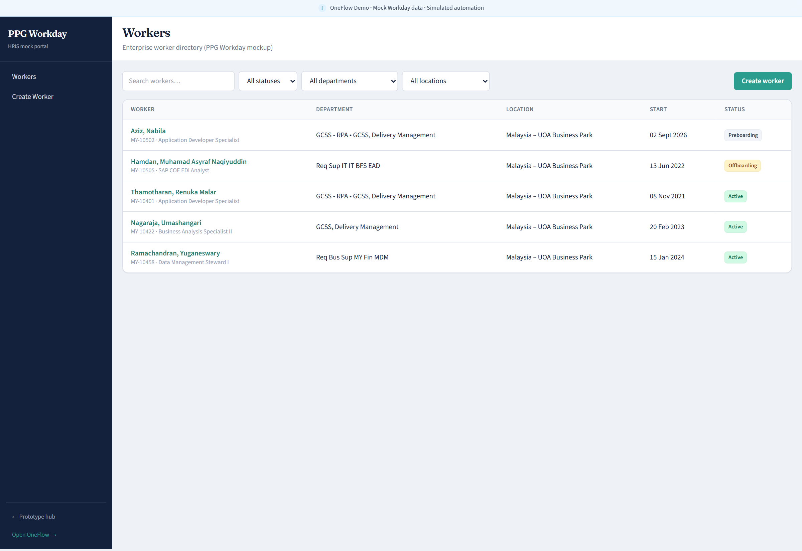

**Figure 5 — Workday mock — five-worker demo population**  
*The prototype does not replace Workday. It shows a worker directory with lifecycle status, including Nabila in Preboarding and Hamdan in Offboarding, so judges can see the HR source beside the orchestration layer.*

### Lifecycle cases

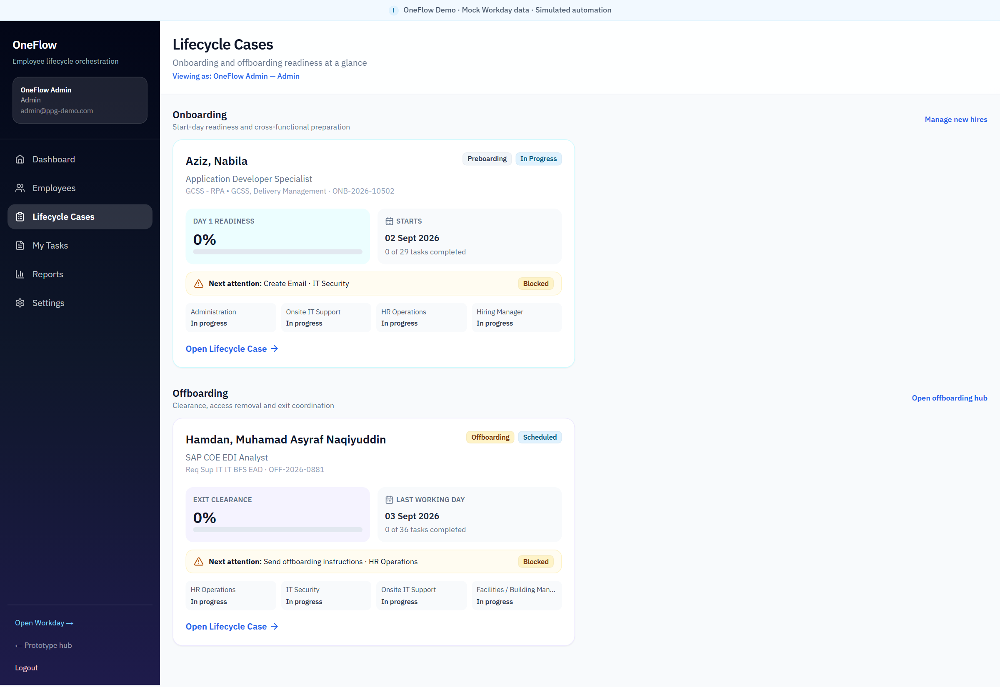

**Figure 6 — Lifecycle Cases — Nabila onboarding and Hamdan offboarding**  
*This is the primary evidence for end-to-end employee lifecycle management. Each case shows Day 1 Readiness or Exit Clearance, the next blocked action, and which teams are still in progress.*

## How OneFlow Works

### Onboarding

1. The employee enters Preboarding in Workday.
2. OneFlow receives or demonstrates the event and opens an onboarding case with role responsibilities.
3. HR, IT, facilities, the hiring manager and specialist teams see their work; the employee sees personal actions, forms and messages.
4. Progress contributes to Day 1 Readiness. Blocked or overdue work is visible on dashboards.

### Offboarding

1. An exit is initiated or demonstrated and an offboarding case opens.
2. Roles receive handover, access, equipment, facilities, finance and specialist responsibilities.
3. IT Security tracks access review and removal; outstanding security work remains visible.
4. Exit Clearance exposes open risk until the case can close.

The prototype uses a Workday mock and simulated automation. Production would use approved Workday events and governed workflow automation.

## Onboarding Scenario — Aziz, Nabila

Aziz, Nabila is the onboarding employee journey. She is an Application Developer Specialist in Preboarding at Malaysia – UOA Business Park. In the demonstration her first day is counted down, Day 1 Readiness is visible, and her next action is explicit.

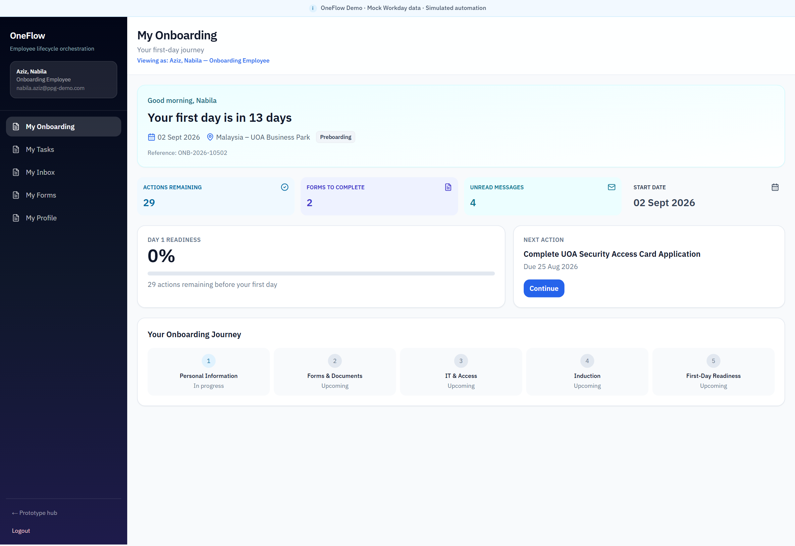

**Figure 7 — Nabila — My Onboarding, Day 1 Readiness and Next Action**  
*This is the employee-facing answer to Challenge 4. Nabila does not chase five departments. She sees one journey, a readiness percentage, remaining actions, forms to complete, unread messages and the next thing to do.*

From the same account she can open forms (Induction Checklist and UOA Security Access Card Application), read onboarding messages in My Inbox, and confirm her profile. Those screens are included in the user manual.

## Offboarding Scenario — Hamdan, Muhamad Asyraf Naqiyuddin

Hamdan, Muhamad Asyraf Naqiyuddin is the offboarding employee journey. He is an SAP COE EDI Analyst with a scheduled last working day. The journey shows remaining actions, Exit Clearance, unread messages and the next action — currently confirmation of last working date in the seeded demo.

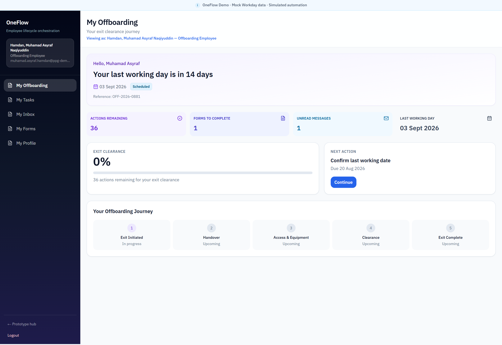

**Figure 8 — Hamdan — My Offboarding and Exit Clearance**  
*Offboarding is the security-sensitive half of Challenge 4. OneFlow gives the departing employee a single exit journey while IT Security, facilities, finance and the manager still own their clearance work behind it.*

On the IT Security My Tasks queue, Hamdan’s case includes review of active system access, scheduled Network ID disablement, email disablement, SailPoint removal, shared-mailbox removal and confirmation that all system access has been removed. Those tasks are the prototype’s access-governance evidence. They are workflow tasks, not live directory or SailPoint execution.

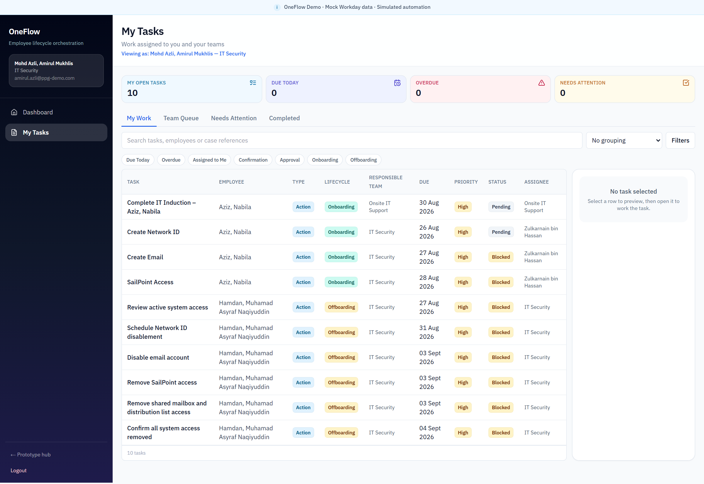

**Figure 9 — IT Security My Tasks — role-based work queue**  
*The queue shows responsible team, due date, priority and status. Nabila’s onboarding access work and Hamdan’s offboarding access-removal work sit in the same security operating picture.*

## Role-Based Collaboration

Challenge 4 explicitly names HR, IT, payroll, facilities, managers and employees. OneFlow provides a shared orchestration layer so those groups work from one case rather than parallel email chains.

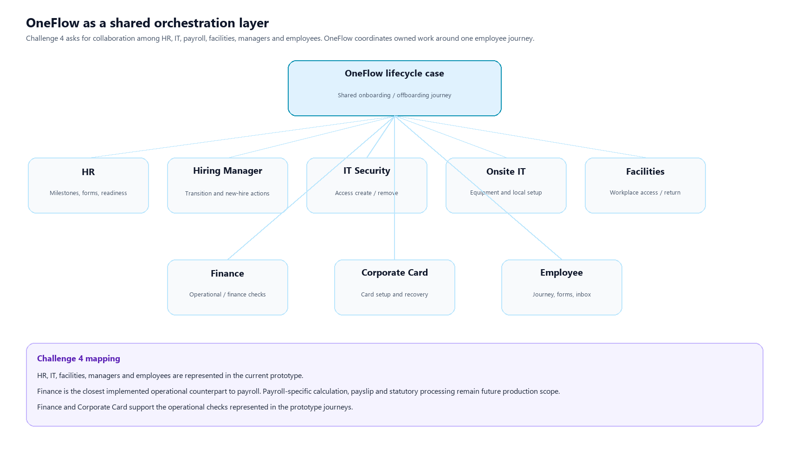

**Figure 10 — OneFlow as a shared orchestration layer**  
*Every role still owns its work. OneFlow does not collapse departments; it connects them around one employee journey.*

| Challenge 4 stakeholder | OneFlow representation | Example responsibilities in the prototype |
| --- | --- | --- |
| HR | HR role and HR Operations tasks | Induction, instructions, last-working-date confirmation, employee-facing milestones |
| IT | IT Security and Onsite IT | Network ID, email, SailPoint, laptop, access removal, equipment recovery |
| Payroll | Not a dedicated payroll engine | Finance is the closest implemented operational counterpart. Payroll calculation and statutory processing remain future scope. |
| Facilities | Facilities role | Access card, workplace setup and return |
| Managers | Hiring Manager | Knowledge transfer, new-hire and transition actions |
| Employees | Onboarding and offboarding employee journeys | Tasks, forms, inbox, profile, readiness or clearance |

The prototype also includes Finance, Corporate Card, Quality and Product Stewardship because those teams own real setup or clearance work in the seeded journeys. That is an extension of the challenge’s cross-functional intent, not a claim that payroll-specific functionality is already implemented.

### Responsible Team vs Assignee

Responsible Team identifies the functional owner of a task; Assignee identifies the actual person responsible for completing it. For example, an IT Security task may have Responsible Team IT Security and Assignee Mohd Azli, Amirul Mukhlis. A manager-owned task may have Responsible Team Manager and Assignee the employee’s current reporting manager.

### Dynamic Manager Assignment in Production

> **Proposed Production Behavior — Not Implemented in Hackathon Prototype**
> The hackathon prototype uses the fixed synthetic Hiring Manager Suib, Ammar Zahiruddin to demonstrate manager-owned lifecycle work. In production, OneFlow would resolve the appropriate manager for each employee from the authoritative Workday worker relationship; Suib is not intended to be the manager for every production employee.

Workday employee record → manager / supervisory relationship → lifecycle event → OneFlow case → manager-owned task template → resolve actual manager → assign task.

For onboarding, the incoming employee or hire event supplies the relevant manager relationship and OneFlow assigns manager-owned onboarding tasks to that individual. For offboarding, OneFlow retrieves the employee’s applicable reporting manager and assigns handover or transition tasks accordingly. Where the business distinguishes a Hiring Manager from a Reporting Manager, the relevant business-process relationship should determine routing.

If Workday reports a manager change while work remains open, incomplete manager-owned tasks should be reassigned and the audit history retained. If no valid manager is available, OneFlow should route the exception to an agreed fallback, such as HR or OneFlow Admin, and surface it for resolution. The final routing policy belongs in enterprise process design.

## User Manual

Use this section to operate the demonstration. Open https://oneflow.highrulez.com. Sign in with the on-screen quick-login account cards.

### Login

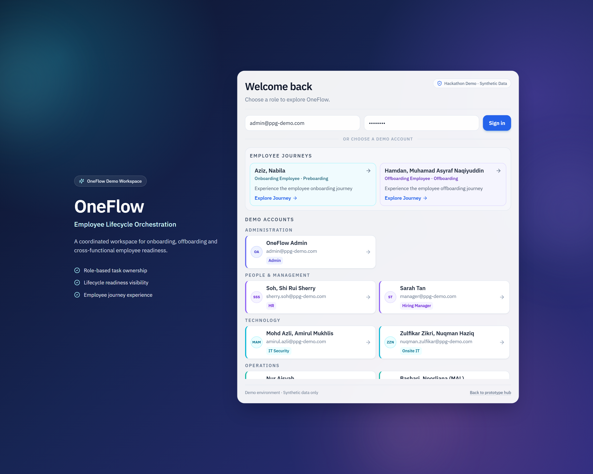

**Figure 11 — Login — OneFlow branding, employee journeys and demo accounts**  
*Choose Nabila or Hamdan to experience the employee journey, or a role account such as OneFlow Admin or IT Security to see cross-functional work.*

1. Open the demonstration URL.
2. Skip the short intro if it appears.
3. From the hub, enter OneFlow, or go directly to login.
4. Select an Employee Journey or a Demo Account using the on-screen quick-login cards.

### Admin Dashboard

Sign in as OneFlow Admin (admin@ppg-demo.com). The Overview shows Preboarding, Offboarding, overdue work, due work, Needs Attention, upcoming joiners and upcoming leavers. Use it as the management briefing screen.

### Lifecycle Cases

Open Lifecycle Cases from the left navigation. Confirm Nabila’s onboarding case (Day 1 Readiness) and Hamdan’s offboarding case (Exit Clearance). Open a case to inspect activity and team progress.

### Role Dashboard

Logout and sign in as Mohd Azli, Amirul Mukhlis (IT Security). The role dashboard shows current employee journeys, upcoming work and items needing attention for that role only.

### My Tasks

From any role, open My Tasks. Columns include task, employee, type, lifecycle, responsible team, due date, priority, status and assignee. Use My Work for personal items and filters for onboarding or offboarding.

### Nabila onboarding, forms, inbox and profile

Sign in as Aziz, Nabila. Complete the employee path: My Onboarding, My Forms, My Inbox, My Profile.

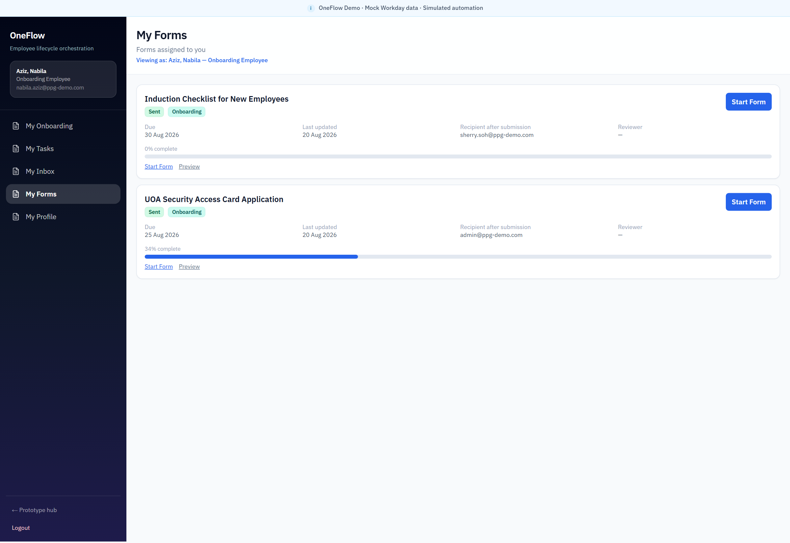

**Figure 12 — Nabila — My Forms**  
*Forms are part of the connected journey, not a separate email attachment process. Induction and access-card applications are visible with due dates and recipients after submission.*

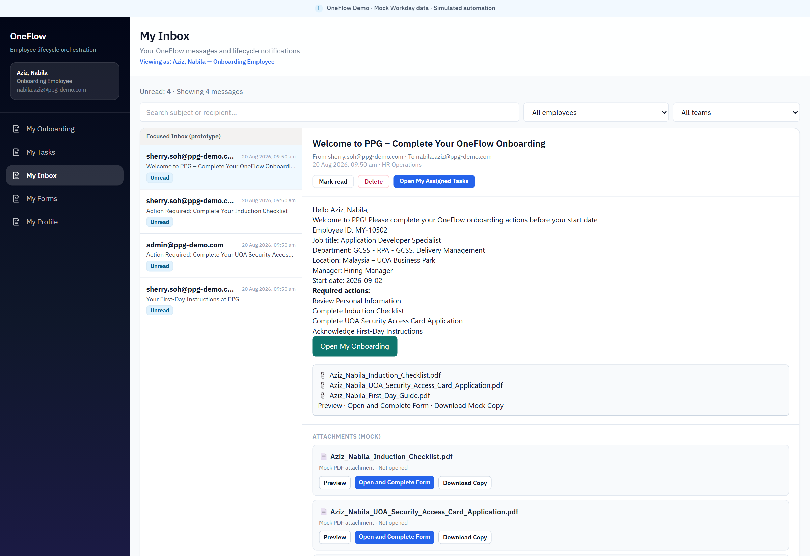

**Figure 13 — Nabila — My Inbox**  
*The employee receives onboarding instructions, form requests and first-day guidance in one inbox. This is prototype messaging, with optional SES delivery behind the admin test-email path.*

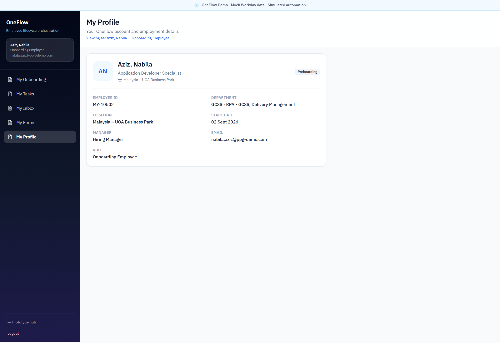

**Figure 14 — Nabila — My Profile**  
*The employee can see the same synthetic employment record the lifecycle case is using: identity, department, location, start date and manager.*

### Hamdan offboarding

Sign in as Hamdan, Muhamad Asyraf Naqiyuddin. Use My Offboarding to show last-working-day countdown, Exit Clearance, remaining actions and the next action.

### Reports

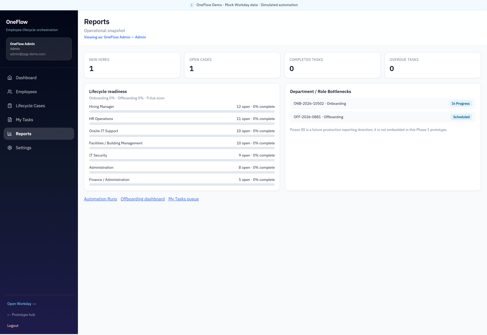

**Figure 15 — Reports — operational snapshot**  
*Reports summarise new hires, open cases, readiness by team and case bottlenecks. Power BI is the proposed production direction and is not embedded in this prototype.*

### Automation

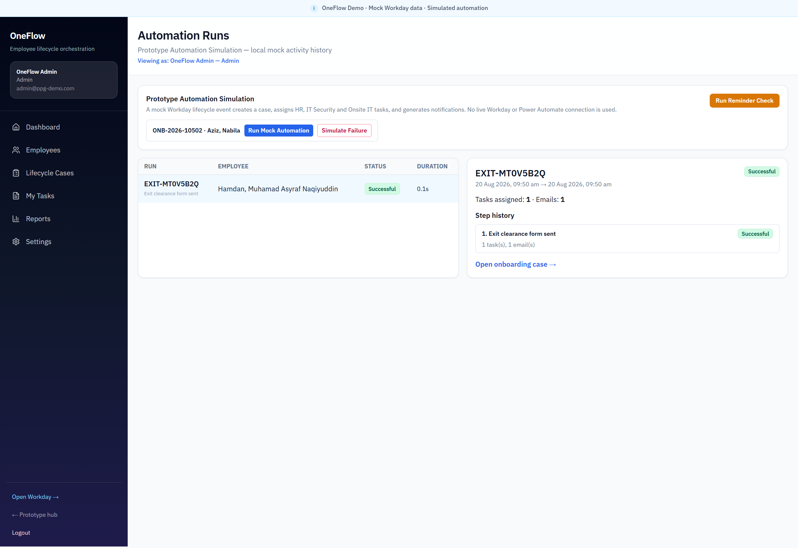

**Figure 16 — Automation simulation**  
*The prototype records simulated automation runs. No live Workday or Power Automate connection is used. This is labelled clearly on the screen.*

### Settings

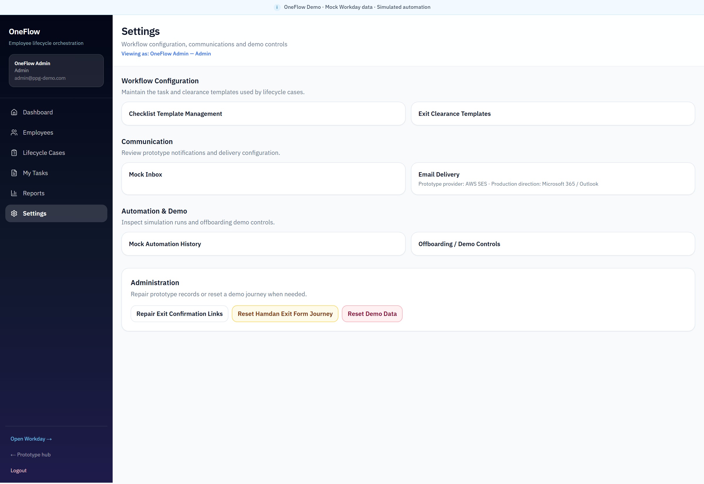

**Figure 17 — Settings — workflow, communication and demo controls**  
*Admin settings group templates, inbox, Email Delivery, automation history and demo reset. Email Delivery is the path to prototype test email; production mail is Microsoft 365.*

## How to Send a Prototype Test Email

> **AWS SES is already configured server-side.**  
> The administrator does not enter AWS credentials in the application. Never publish a real mapped destination, password, token or access key. AWS SES is a hackathon prototype convenience. It is not the proposed PPG production email solution.

1. Login as OneFlow Admin.
2. Go to Settings.
3. Open Email Delivery.
4. Confirm Delivery Configuration: delivery mode, region, sender, application URL, and the message that credentials are configured server-side.
5. Scroll to Recipient Mappings.
6. Find the synthetic OneFlow identity, for example nabila.aziz@ppg-demo.com.
7. Enter the desired approved test mailbox under Delivery Destination. Do not use an unapproved personal mailbox.
8. Save settings.
9. Open the Send Test Email area.
10. Select the simulated OneFlow recipient.
11. Click Send Test Email.
12. Check the mapped test mailbox.
13. Review the delivery result or audit message on the same page.

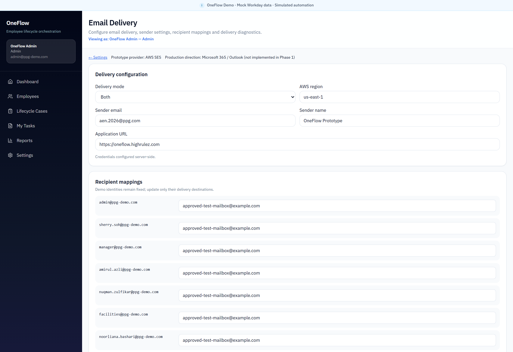

**Figure 18 — Email Delivery — configuration, application URL and server-side credentials**  
*This screen shows that prototype mail is configured in the application, not typed in by each admin. Destinations in this dossier are replaced with a safe example mailbox.*

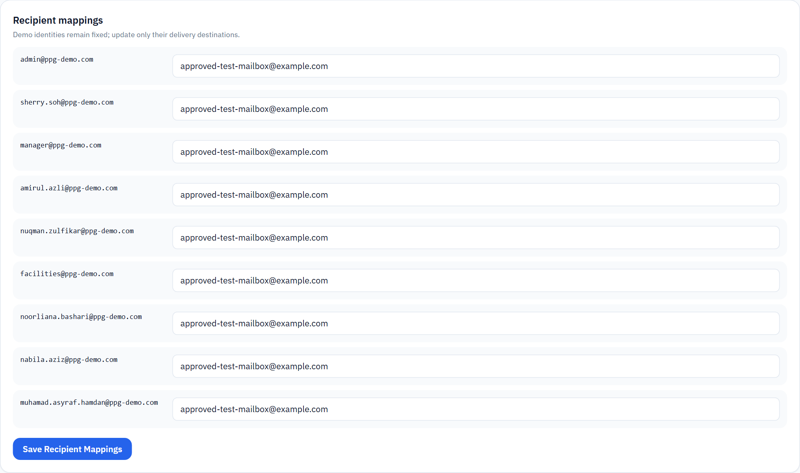

**Figure 19 — Recipient mapping — demo identity to delivery destination**  
*Synthetic identities stay fixed. Only the delivery destination changes. The dossier shows approved-test-mailbox@example.com rather than any real mapped inbox.*

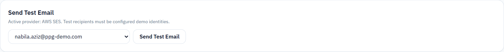

**Figure 20 — Send Test Email**  
*Select a simulated recipient such as nabila.aziz@ppg-demo.com and send. The page reports the delivery result. A recipient mapping must be saved before sending a test email. Saved mappings remain available until they are changed or the demo configuration is reset.*

### Prototype email versus production email

| Environment | Mail approach | Notes |
| --- | --- | --- |
| Hackathon prototype | Mock Inbox plus optional AWS SES test delivery | Useful for judges to prove a message can leave the system |
| Proposed production | Microsoft 365 / Outlook / Exchange Online | Fits PPG’s enterprise collaboration stack |
| Potential enterprise integration | Microsoft Graph, Power Automate Outlook connector, or an approved PPG messaging platform | To be decided in architecture review |

AWS SES is not the proposed PPG production solution.

## Current Prototype Architecture

The current system is a Next.js application with a Workday mock, prototype persistence, simulated automation, a mock inbox and optional AWS SES test delivery. It is sufficient to demonstrate the Challenge 4 operating model. It is not a production deployment blueprint.

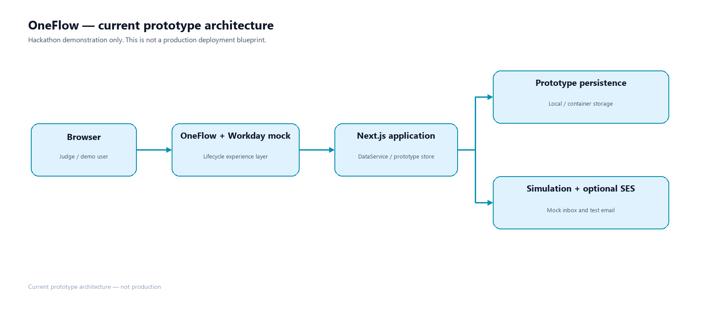

**Figure 21 — Current prototype architecture**  
*Judges should read this as the demonstration stack, not as the recommended enterprise architecture.*

## Proposed Production Architecture

If OneFlow progresses beyond the hackathon, the recommended direction is Microsoft-first and Workday-preserving. None of the production boxes below are implemented in the prototype.

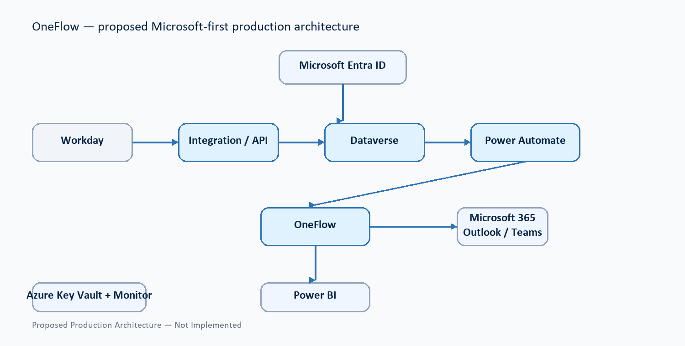

**Figure 22 — Proposed Microsoft-first production architecture**  
*Proposed Production Architecture — Not Implemented. Workday remains the HR source. Identity, data, workflow, UI, communication, reporting, secrets and monitoring sit in Microsoft / Azure services.*

## Recommended Production Technology

| Technology | Role if OneFlow becomes production |
| --- | --- |
| Workday / approved Workday API | Authoritative employee, hire, termination and manager/supervisory relationships |
| Microsoft Entra ID | Authentication, SSO, groups, RBAC and enterprise-user resolution |
| Dataverse | Governed store for cases, tasks, employee relationships and audit-grade operational data |
| Power Automate | Workflow, reminders, dynamic manager routing and reassignment handling |
| Power Apps | Proposed production UI: model-driven application shell, Custom Pages for richer OneFlow dashboards and employee lifecycle experiences, and PCF controls where additional UI capability is required |
| OneFlow | Employee and role experience for the connected lifecycle, delivered through Power Apps in a production implementation |
| Microsoft 365 / Outlook / Teams | Production messaging and collaboration |
| Power BI | Lead time, SLA, overdue, clearance and satisfaction reporting |
| Azure Key Vault | Secrets, certificates and connection credentials |
| Azure Monitor / Application Insights | Reliability, diagnostics and operational telemetry |
| Integration / API services | Governed Workday and identity/security-system connections where required |

The current Next.js prototype validates the UX and workflow concept. A Microsoft-native production implementation could use Power Apps as the application shell, Dataverse as the operational store, and Power Automate for orchestration. That production implementation is not built in this hackathon prototype.

### Why Microsoft / Azure

Challenge 4 constraints include technology and security. A Microsoft-first path aligns with the organisation's existing Microsoft/Azure ecosystem and governance model: identity, email, collaboration, low-code workflow, reporting and cloud operations. It reduces the need to introduce a disconnected new platform solely for lifecycle coordination. Feasibility is therefore higher than a greenfield stack, provided Workday integration and security review are funded properly.

## Prototype vs Production

| Capability | Prototype | Production direction |
| --- | --- | --- |
| HR source | Workday mock, five synthetic workers | Approved Workday integration |
| Authentication | Demo accounts | Microsoft Entra ID |
| Application UI | Next.js prototype | Power Apps (model-driven / Custom Pages) — proposed, not implemented |
| Data | Prototype / local persistence | Dataverse or approved datastore |
| Automation | Simulated runs | Power Automate |
| Email | Mock Inbox + optional AWS SES | Microsoft 365 / Outlook |
| Reporting | In-app operational snapshot | Power BI |
| Manager task assignment | Fixed synthetic Hiring Manager used for demonstration | Dynamic assignment using the employee’s Workday manager/supervisory relationship, resolved to the corresponding enterprise identity |
| Secrets / monitoring | Server-side prototype configuration / logs | Key Vault / Azure Monitor / Application Insights |
| Access governance | IT Security workflow tasks | Entra ID, governed IAM/IGA integrations, audit |

## How OneFlow Addresses the Challenge Constraints

| Constraint | Prototype contribution | Production control — proposed, not already built |
| --- | --- | --- |
| Resources | Automation and role routing reduce manual coordination effort in the operating model | Pilot measures hours avoided; licensing and implementation still required |
| Technology | Working UX and workflow on a contained prototype stack | Microsoft-first architecture uses the existing enterprise ecosystem |
| Security | Access and clearance work is visible and owned | Entra ID, RBAC, Key Vault, governed integrations, access workflow and audit |

Do not read the production column as already implemented. The prototype proves the experience and workflow concept. Production controls remain future work.

## Production Readiness Gap

- Replace the Workday mock with approved Workday APIs and event contracts.
- Replace demo login with Microsoft Entra ID and role mapping.
- Move operational data to Dataverse or another approved store, with retention and audit.
- Implement Power Automate for assignment, reminders and system hand-offs.
- Implement dynamic manager resolution so manager-owned lifecycle work is assigned to the employee’s actual Workday reporting/hiring manager rather than a fixed demo role account.
- Replace AWS SES with Microsoft 365 / Outlook.
- Integrate identity and security systems so access removal is executed, not only tasked.
- Add Power BI for the success-criteria KPIs.
- Complete security review, privacy assessment, testing, training and change management.
- Run a controlled Malaysia pilot before wider scale-out.

## Security and Privacy

The demonstration uses synthetic @ppg-demo.com identities. It is not connected to production PPG employee data. Prototype email destinations must be approved test mailboxes only. Production would require Entra ID, least-privilege RBAC, Key Vault, governed integrations, audit logging and a formal security assessment. Those controls are proposed, not present.

## Cost and Investment Considerations

This dossier does not present a Docker or hosting runbook. For decision makers, the meaningful cost is the production path: integration, licensing, implementation, control and adoption.

Likely cost drivers include:

- Workday integration design, build and support
- Power Platform licensing, including Power Apps where used, Dataverse capacity and Power Automate
- Power BI for operational reporting
- Azure services such as Key Vault, monitoring and any required API layer
- Implementation, testing and environments
- Security review and privacy assessment
- Training and change management
- Ongoing support

Public Microsoft list prices, checked on 20 August 2026, include USD 20 per user per month for Power Apps Premium (USD 12 at a 2,000-seat threshold), USD 15 per user per month for Power Automate Premium, and USD 14 per user per month for Power BI Pro, each on annual billing. Microsoft states that published web prices are for marketing purposes and may differ by currency, region and agreement. Actual PPG pricing may differ due to enterprise agreements, existing Microsoft 365 bundles, and regional or volume terms. These figures are orientation only, not a PPG quote. See Pricing References in the Appendix.

## ROI and Success Metrics

A production pilot should measure the Challenge 4 success criteria directly. Suggested starter KPIs:

- Average onboarding lead time and percentage ready before Day 1
- Average offboarding lead time and percentage cleared by last working day
- Task SLA and overdue rate by role
- Incomplete or late IT Security access-removal tasks
- Employee onboarding and offboarding satisfaction
- Manual chase volume for lifecycle follow-up
- Equipment and workspace task completion before need-by dates

## Roadmap

1. Hackathon prototype — completed concept demonstration.
2. Enterprise validation — architecture, security, privacy and Workday integration review.
3. Production foundation — Entra ID, Dataverse, environments and monitoring.
4. Integration and automation — Workday, Power Automate and Microsoft 365.
5. Reporting, controlled Malaysia pilot, then scale if KPIs are met.

## Risks and Limitations

| Risk or limitation | Implication |
| --- | --- |
| Mock Workday and demo authentication | The prototype cannot be connected to live HR data as-is. |
| Simulated automation | Task creation is demonstrated, not executed by Power Automate. |
| Workflow-level access governance | Security tasks are tracked; accounts are not actually disabled in enterprise directories. |
| No measured KPI baseline | Lead time and satisfaction claims would be premature. |
| Partial resource utilization | Equipment and facilities work is visible, not optimized by inventory analytics. |
| Change adoption | Cross-functional value depends on HR, IT, facilities and managers actually working in the case. |

## 5–10 Minute Demo Guide

1. Hub (1 min): Workday versus OneFlow, proposed Microsoft path, Team Error 404.
2. Admin dashboard (1–2 min): Preboarding, Offboarding, Needs Attention, Nabila joining, Hamdan leaving.
3. Lifecycle Cases (1 min): Day 1 Readiness and Exit Clearance.
4. IT Security (2 min): role dashboard and My Tasks, including access-removal work.
5. Nabila (2 min): onboarding, next action, forms, inbox.
6. Hamdan (1–2 min): offboarding and Exit Clearance.
7. Optional (1 min): Settings → Email Delivery → Send Test Email, if an approved mapping is available.

## FAQ

#### Is OneFlow a Workday replacement?

No. Workday remains the HR source. OneFlow orchestrates the journey around it.

#### Did you fully solve Challenge 4?

No. We demonstrated and validated the solution at prototype level. Measurable operational impact needs a production pilot.

#### Why is payroll not a separate module?

The prototype includes Finance as the closest operational counterpart. Payroll-specific calculation, payslip and statutory processing are future production scope.

#### Is AWS SES the production email plan?

No. SES is optional prototype test delivery. Production should use Microsoft 365 / Outlook / Exchange Online.

#### Are the people in the demo real employees in this system?

The demonstration uses synthetic @ppg-demo.com records. Treat every mailbox, name and identifier in the demo as prototype data.

#### Can judges send a test email?

Yes, as OneFlow Admin, after mapping a synthetic identity to an approved test mailbox. Credentials are server-side.

## Conclusion

Challenge 4 asks for a more connected employee journey and better collaboration across the functions that already own onboarding, offboarding, access, workplace administration and resource management. OneFlow answers that brief with a working prototype: one case, owned work, employee experience, and visible readiness or clearance.

PPG should consider progressing OneFlow because the business problem is real, the prototype is usable, the production path fits the Microsoft and Workday estate, and the success criteria can be measured in a contained pilot. The next value is not another mock-up. It is a governed production foundation and a Malaysia pilot that proves lead time, accountability and access-control outcomes.

> **Why OneFlow should progress beyond the hackathon**  
> The prototype has already reduced the largest risk in a lifecycle programme: ambiguity about the operating model. What remains is integration, security and measurement — work that is now well bounded.

## How OneFlow Could Be Adopted

> **Proposed adoption path — not implemented in the hackathon prototype.**  
> This is a business and implementation sequence for a production pilot. It is not a deployment runbook, and none of these production steps are built in the hackathon prototype.

1. Validate the OneFlow operating model with HR, IT, Facilities, Finance and managers.
2. Confirm the Workday lifecycle events and data required.
3. Confirm enterprise architecture and security requirements.
4. Establish Microsoft Entra ID authentication and role mapping.
5. Create the governed lifecycle data model in Dataverse or another approved store.
6. Implement workflow orchestration in Power Automate.
7. Define manager-routing policy and implement dynamic manager resolution from Workday relationships.
8. Integrate Microsoft 365 / Outlook notifications.
9. Integrate identity/access systems for real provisioning and removal.
10. Implement Power BI success-criteria reporting.
11. Run a controlled Malaysia pilot.
12. Measure lead time, readiness, clearance, overdue work, security gaps and employee satisfaction.
13. Scale only if pilot KPIs demonstrate value.

## Appendix

### Project team

Team Error 404

- Thamotharan, Renuka Malar
- Ramachandran, Yuganeswary
- Hairul Afizee
- Bashari, Noorliana

### Solution Links & Submission Materials

| Item | Reference |
| --- | --- |
| Live Demonstration | https://oneflow.highrulez.com |
| Solution Documentation | OneFlow_Project_Documentation.docx |
| Final Presentation Deck | See the accompanying final-presentation PowerPoint in the submission folder. |
| Supporting Materials | Screenshots, architecture diagrams, Challenge 4 mapping, user manual, test-email guide, production architecture and adoption roadmap are included in this dossier and supporting assets. |

### Demonstration

https://oneflow.highrulez.com

### Status labels used in this dossier

| Label | Meaning |
| --- | --- |
| Demonstrated | A judge can see and use the capability in the prototype. |
| Partially demonstrated / simulated | The concept is shown; the production mechanism or measured result is not. |
| Proposed / not implemented | Recommended for production; absent from the prototype. |

### Screenshot and diagram index

Figures were captured from the public demonstration at https://oneflow.highrulez.com. Email destinations are masked to a safe example mailbox.

| Figure | Evidence |
| --- | --- |
| 1–3 | Lifecycle model, Admin dashboard, IT Security dashboard |
| 4–6 | Project hub, Workday mock, Lifecycle Cases |
| 7–9 | Nabila onboarding, Hamdan offboarding, IT Security My Tasks |
| 10–14 | Role collaboration, login, forms, inbox, profile |
| 15–17 | Reports, automation, settings |
| 18–20 | Email delivery, recipient mapping, Send Test Email |
| 21–22 | Prototype architecture and proposed production architecture |

### Pricing references

Public list prices were checked on 20 August 2026. Microsoft notes that web prices are for marketing purposes and may differ by currency, country, region and agreement.

| Source | URL | Figures used |
| --- | --- | --- |
| Power Apps pricing | https://www.microsoft.com/en-us/power-platform/products/power-apps/pricing | Premium USD 20 / user / month; USD 12 at 2,000-seat minimum |
| Power Automate pricing | https://www.microsoft.com/en-us/power-platform/products/power-automate/pricing | Premium USD 15 / user / month |
| Power BI pricing | https://www.microsoft.com/en-us/power-platform/products/power-bi/pricing | Pro USD 14 / user / month |
| Power Platform Licensing Guide | https://aka.ms/pplic | Confirms the same USD list prices; web prices are marketing-only |

